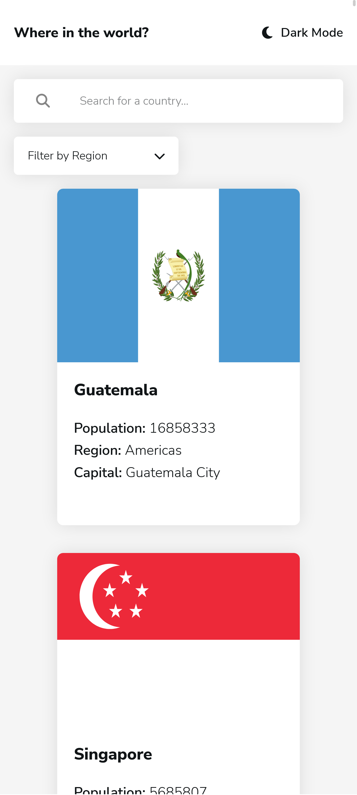

# Frontend Mentor - REST Countries API with color theme switcher solution

This is a solution to the [REST Countries API with color theme switcher challenge on Frontend Mentor](https://www.frontendmentor.io/challenges/rest-countries-api-with-color-theme-switcher-5cacc469fec04111f7b848ca). Frontend Mentor challenges help you improve your coding skills by building realistic projects. 

## Table of contents

- [Overview](#overview)
  - [The challenge](#the-challenge)
  - [Screenshot](#screenshot)
  - [Links](#links)
- [My process](#my-process)
  - [Built with](#built-with)
  - [What I learned](#what-i-learned)
  - [Continued development](#continued-development)
  - [TODOs](#todos)
  - [Useful resources](#useful-resources)
- [Author](#author)


## Overview

### The challenge

Users should be able to:

- See all countries from the API on the homepage
- Search for a country using an `input` field
- Filter countries by region
- Click on a country to see more detailed information on a separate page
- Click through to the border countries on the detail page
- Toggle the color scheme between light and dark mode *(optional)*

### Screenshot

|  |  |
| --- | --- |
|  |  |

### Links

- [Solution URL](https://www.frontendmentor.io/solutions/responsive-rest-countries-react-app-with-color-theme-switcher-WwgmoKuJMC)
- [Live Site URL](https://luieitalian.github.io/countries-api-app/)

## My process

### Built with

- Semantic HTML5 markup
- CSS custom properties
- Flexbox
- CSS Grid
- Mobile-first workflow
- [React](https://reactjs.org/) - JS library


### What I learned

- I learned how to fetch data from a RESTful API.
- I learned more about routing in React.

### Continued development

- I want to change the getCode function to a custom hook to get things a lil bit more organised.
- If I see a better solution to color theme implementation I will do it.
- I would actually find it really cool while waiting for the data to arrive, If I show the user a loading icon or something instead of showing a blank "Content" component.

## TODOs 

- Clicking to the border countries on the detail page redirects to the clicked country

### Useful resources

- [Routing](https://blog.webdevsimplified.com/2022-07/react-router/) - This resource helped me managing the routing of the site. I strongly recommend this site for routing purposes.
- [Deployment](https://www.youtube.com/watch?v=AOqY6disSVI) - I highly recommend Dave Gray's deployment video for create-react-app. I deployed the site on github pages with this video.


## Author

- [Frontend Mentor](https://www.frontendmentor.io/profile/Luieitalian)
- [Twitter](https://www.twitter.com/luieitalian)
- Discord -> lui#6662


## Questions

- The site is requesting the data again when clicked on the 'Back' button on country details page. And I think that causes efficiency problems. How can I fix it? ( I solved it by adding router, and moving getData function one component up which is App component.)

- When I refresh on the country details page, the {countries} prop that I provide to CountryPage is not working as expected. When I refresh the page, the {countries} prop that has been provided to CountryPage component becomes an empty array. How can I fix this?
```js
<Route path="/details/:id" element={<CountryPage countries={countries} />}/>
```
- My color theme implementation looks a bit messy. I've got code in useEffect hook in App.js and a separate switchTheme function there. I used react-color-theme npm package to get things a little organised. How can I reimplement changing the color theme so that it doesn't use up all the space in the code?
